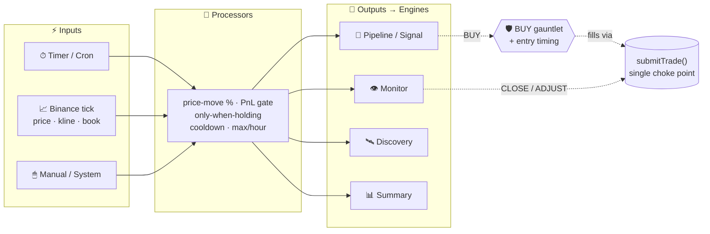

<div align="center">

# ⚡ cryptoBot

### A self-hosted swarm of LLM trading agents that research, decide, time, and babysit every position — on a wiring graph you draw yourself.

<br>

[](https://www.typescriptlang.org/)
[](https://nodejs.org/)
[](https://react.dev/)
[](https://www.mongodb.com/)
[](https://www.docker.com/)

<br>

`Local LLMs · Ollama / llama.cpp`  ⟶  `Binance via ccxt`  ⟶  `Puppeteer web research`  ⟶  `Telegram approvals`

</div>

---

> ### ⚠️ This places **real orders with real money** on Binance.
> There is **no paper / stub mode** — live API keys are required. Crypto trading carries a substantial risk of loss. Start tiny, keep human approval (`--approval`) on until you trust it, and treat every dollar as one you can afford to lose. **Nothing here is financial advice.**

---

## 🎯 The idea

cryptoBot isn't *a strategy*. It's a **team of specialized AI engines** — each a focused LLM module — that cooperate over a typed event bus:

> 🌐 search the web → 🧪 compress news to sentiment → ⚖️ debate BUY / HOLD → 🎯 time the entry on a live price feed → 👁️ babysit the position until it closes.

And the part that makes it different: **you decide what triggers what** by drawing a **routing graph** — a visual node canvas of `inputs → processors → outputs` that replaces hardcoded cron jobs. A price-move on BTC can fire the monitor. A 15-minute timer can fan into the pipeline *only when you're holding*. It's a flowchart that actually runs your bot.



---

## 🧠 The engines

Every engine is an independent worker triggered through the routing graph. **They never trade directly** — they emit events, and `submitTrade()` is the single choke point for every real exchange order (concurrency-guarded, OCO-aware, atomic DB writes).

| Engine | Role |
|---|---|
| 🔬 **Pipeline / Signal** | The entry brain. Research the web → extract sentiment → rank articles → analyst verdict (BUY / HOLD + confidence + SL/TP). A BUY runs the gauntlet, then the entry-timing engine. |
| 🛰 **Discoverer** | LLM-scored hunt for new candidate coins; approved picks feed the watchlist. |
| 👁 **Monitor** | The only engine that manages **open** positions — proposes SL/TP adjustments (ADJUST), partial trims (REDUCE), or a full exit (CLOSE), with guardrails against closing healthy winners. |
| 📊 **Summary** | Read-only portfolio strategist. Bundles the whole book + live market context into a narrative briefing (health, risk, observations, suggestions). Never trades. |
| 🔁 **Position check** | A 30s reconcile loop — open positions vs. live prices and exchange OCO fills. |
| 💬 **Agent** | On-demand conversational assistant with a native tool-calling loop. Reads everything, takes only **safe, non-trading** actions (manage watchlist, trigger engines). |

### 🤖 Classic vs. Agentic — two brains per slot

Several engines ship in **two mutually-exclusive flavors**, switchable in Settings. The classic ones run a fixed LLM chain; the agentic ones run a **native tool-calling loop** that reads candles, indicators, news and its *own long-term memory*, reasons across multiple rounds, then commits to a verdict.

| Slot | Classic | Agentic (alternative) |
|---|---|---|
| Entry signal | `pipeline` — researcher → extractor → analyst | `agent` — **Agent Signal**, one agent per coin |
| Position monitor | `a/b/ab/abc` — single-shot ensemble | `d` — **Monitor-D**, agentic position manager |
| Entry timing | static `entry_*` band / planner | **Entry Agent** — a living per-coin entry manager |

### 🎯 Smart entry timing

When entry timing is on, a BUY isn't filled at the tick. It's registered as an **intent** that watches the live price feed and fires only on a **pullback / in-band fill** — or cancels itself via invalidate-drop, chase-cap, or TTL. The band anchors to the **live** price at registration (the analyzed price is minutes-stale after the slow LLM pipeline). The **Entry Planner / Entry Agent** can size that band per-coin from the analyst's thesis.

### 🛡 The BUY gauntlet

Before any BUY becomes real it must clear every gate:
`max positions` · `not already held` · `no pending intent` · `min USDC` · `position size` · and the **fee-edge gate** — the expected move must beat round-trip fees.

---

## 🔌 LLM integration — bring your own local models

Every LLM call goes through `core/llm.ts` against **local OpenAI-compatible endpoints** (Ollama / llama.cpp) via the OpenAI SDK. Nothing leaves your machine.

- **🗂 Shared endpoint catalog** — define named `{ baseURL, model, maxTokens, parallel }` endpoints once in *Settings → LLM Models*; each module **selects** one by id.
- **🪂 Per-module fallback** — if a primary endpoint *throws*, the same prompt retries once against a configured fallback. Each attempt is its own `llm_calls` row.
- **🚦 Per-key concurrency gates** — each base URL is serialized (one in-flight) by default so a one-at-a-time local server stays happy; different URLs run in parallel. Flag an endpoint `parallel` (with optional `maxParallel`) to lift the cap.
- **❤️ Endpoint health monitor** — a background probe drives the header status badge and lets routing divert away from a dead primary.
- **🔭 Full observability** — every call recorded; live calls stream to the LLM activity view (tokens included).

---

## 🏗 Architecture

A monorepo of two **independent** Node packages talking over **HTTP + WebSocket** (`ws://localhost:3000/ws`) — no shared package. `index.ts` is now a 14-line entry point; all behavior lives in focused modules.

```
cryptoBot/
├── backend/              Node.js + TypeScript (ESM) — the long-running trade brain
│   └── src/
│       ├── index.ts          register handlers, start, shutdown — that's it
│       ├── app/              ⭐ scheduler · wiring (bus handlers) · lifecycle
│       ├── routing/          ⭐ the visual node-graph engine (inputs→processors→outputs)
│       ├── core/             typed event bus · LLM client + scheduler · endpoint health
│       ├── pipeline/         classic entry pipeline (research → extract → analyze → buy)
│       ├── webSearch/        query-driven crawl + per-page LLM extraction (cached)
│       ├── researcher · extractor · analyst   the classic chain's stages
│       ├── discoverer/       LLM-driven new-coin discovery
│       ├── monitor/          classic open-position management
│       ├── summary/          portfolio strategist / briefings
│       ├── entry/            deferred entry-timing engine (pullback firing)
│       ├── agent/            tool-calling assistant + agentic engines
│       │                     (Agent Signal · Monitor-D · Entry Agent)
│       ├── execution/        submitTrade() · exits · adjustments · approvals
│       ├── portfolio/        sizing · ATR SL/TP · OCO · fee-aware PnL · fee-edge gate
│       ├── market/           live price cache (WS) + OHLCV / indicators
│       ├── trader/           ccxt Binance wrapper
│       ├── scraper/          Puppeteer-extra stealth browser + DuckDuckGo
│       ├── telegram/         Telegraf approval bot + notifier
│       ├── host/             host self-update bridge + update checker
│       ├── api/              Express routes + WebSocket broadcast
│       ├── db/               Mongo repositories · indexes · transactions · settings cache
│       └── config/           env config · LLM endpoint resolution
└── frontend/             React + Vite + Tailwind — single-page app (no router)
    └── src/pages/        Dashboard · ControlRoom · Routing graph · Agent · Portfolio
                          Trade · Monitor · EntryDesk · EntryAgent · Discover · Summary
                          Charts · LLM / Stats / Debug · EventStream · Cache
                          TradingState · Host · Settings · Logs
```

### 🗺 The routing engine

The four engine triggers are **no longer hardcoded crons**. They're **timer input nodes** in a directed graph (`routing_graph`, persisted as one JSON blob — the single source of truth for what triggers what):

- **Inputs** fire — timer/cron, Binance ticks (price · kline · book · trade · depth), manual, or system events.
- **Processors** evaluate a condition and propagate only if it passes — `price-move %`, `PnL gate`, `only-when-holding`, `cooldown`, `max/hour`.
- **Outputs** trigger an engine — pipeline / monitor / discovery / summary.

Every step emits a `routing_pulse` so the frontend **animates the live flow-graph** as signals travel it. Saving settings re-syncs the managed timers without a restart.

### 📐 Conventions

- Each module's public API is its `index.ts` — never import internal files.
- Cross-module side effects go through the **typed event bus** (`core/events.ts`).
- Structured logging only: `logger.info('msg', { data })`.
- Shared types in `backend/src/types.ts`.

### 🍃 Database

**MongoDB 7**, run as a single-node replica set (`rs0`) — required for the multi-document transactions `submitTrade()` relies on (atomic trade + position + portfolio writes). One database (`cryptobot`), one collection per entity, accessed only through typed `Repository` instances in `db/repositories.ts`. Integer ids from the legacy SQLite era are preserved via a `counters` collection. Settings live in an in-memory cache served **synchronously** and kept current on save.

> **Quote currency is USDC**, not USDT — Binance pairs are `<COIN>USDC` (despite some legacy `*Usdt*` function names).

---

## 🚀 Quick start

**Prerequisites:** Node 22+ (or Docker) · a Binance account with API key + secret · a local OpenAI-compatible LLM ([Ollama](https://ollama.com/) or llama.cpp) · *(optional)* a Telegram bot for approvals.

### 1️⃣ Configure

```bash
cp .env.example .env
```

```ini
# Required
BINANCE_API_KEY=your_key
BINANCE_SECRET=your_secret
LLAMA_BASE_URL=http://host.docker.internal:11434/v1   # or http://localhost:11434/v1 bare-metal
LLAMA_MODEL=llama3

# Optional
TELEGRAM_BOT_TOKEN=
TELEGRAM_CHAT_ID=
PORT=3000

# Optional — login gateway (see "Lock it down" below). Off until a password is set.
AUTH_PASSWORD_HASH=
AUTH_SECRET=
```

Per-module LLM overrides (`EXTRACTOR_*`, `ANALYST_*`, `MONITOR_*`, `SUMMARY_*`, `ENTRY_PLANNER_*`, `AGENT_*`, …) all fall back to `LLAMA_*` — set them only to run different models per engine. Most of this is also editable live from **Settings → LLM Models**.

### 2️⃣ Run

<table>
<tr><th>🐳 Docker (recommended)</th><th>🔧 Bare-metal</th></tr>
<tr valign="top"><td>

```bash
docker-compose up
```

Brings up Mongo (rs0), backend, frontend.

</td><td>

```bash
# Terminal 1
cd backend && npm install && npm run dev

# Terminal 2
cd frontend && npm install && npm run dev
```

</td></tr>
</table>

Then open **http://localhost:5173** → backend on **:3000**, frontend on **:5173**, Mongo on **:27017**.

> 🔐 **Start safe:** launch the backend with `--approval` (or set `approval_required`) to require human approval for *every* trade signal until you trust its behavior.

### 🔒 Lock it down — enable authentication

By default the API and dashboard are **open to anyone who can reach the port** (a warning is logged on every boot). Since this app places real orders, put a login in front of it before exposing it beyond `localhost`.

The gateway guards the whole API **and** the WebSocket behind a username + password. Sessions are stateless **HS256 bearer tokens**; the password is stored only as a **scrypt hash** (never plaintext); the login route is rate-limited against brute force. It's built on Node's `crypto` — no extra dependencies.

**1. Generate credentials** (the plaintext never touches `.env`):

```bash
cd backend && npm run auth:hash -- 'your-strong-password'
```

**2. Paste the two printed lines into your `.env`** and restart:

```ini
AUTH_PASSWORD_HASH=scrypt$16384$8$1$…    # from the command above
AUTH_SECRET=…                            # token signing secret (≥16 chars)
# Optional:
AUTH_USERNAME=admin                      # default: admin
AUTH_TOKEN_TTL_MINUTES=720               # session lifetime, default 12h
```

Auth turns **on automatically** once `AUTH_PASSWORD_HASH` (or `AUTH_PASSWORD`) is set — the dashboard then shows a login screen and a **Sign out** button. Leave them blank to keep auth off (local-only use). Set `AUTH_ENABLED=false` to force it off, or `AUTH_ENABLED=true` to require it (boots with an error if no password is configured).

> ⚠️ If you skip `AUTH_SECRET`, an ephemeral one is generated each boot — logins survive until the next restart. Set it for stable sessions.

---

## 🛠 Commands

| | Backend (`backend/`) | Frontend (`frontend/`) |
|---|---|---|
| **dev** | `npm run dev` — tsx watch, hot-reload :3000 | `npm run dev` — Vite :5173 |
| **start** | `npm start` | `npm run preview` |
| **build** | `npm run build` | `npm run build` |
| **check** | `npm run lint` — type-check (the only gate) | `npm run build` includes `tsc` |

> There is **no unit-test runner**. `npm run lint` (TypeScript type-check) is the only automated gate — verify behavior by running the app.

### 🔍 Ops toolkit (`tools/`)

```bash
node tools/db.mjs  collections           # inspect MongoDB
node tools/db.mjs  trades 10
node tools/app.mjs status                # start / stop / logs / lint
node tools/app.mjs logs backend 200
```

See [AGENTS.md](./AGENTS.md) and [tools/README.md](./tools/README.md) for full usage.

---

## 🖥 Dashboard

A single-page React app — page switching via `useState`, no router — with **7 themes** (`dark` · `midnight` · `neon` · `light` · `aurora` · `synthwave` · `volcano`) and everything live over WebSocket. Highlights: a **Control Room**, the animated **Routing graph**, the **Entry Desk** (pending intents), per-agent monitors, candle **Charts** (recharts), and a deep **LLM Debug** view with live token streaming.

### 🔄 One-click self-update

**Settings → System → Update app** pulls the latest `main` and rebuilds + restarts the whole stack from the dashboard — no SSH. A host-side **systemd watcher** does the work, so it survives `docker compose down`. The sidebar pins an update when `origin/main` is ahead.

```bash
sudo tools/updater/install-updater.sh
```

See [tools/updater/README.md](./tools/updater/README.md).

---

## 📚 Further reading

- **[CLAUDE.md](./CLAUDE.md)** — deep architecture & code conventions
- **[AGENTS.md](./AGENTS.md)** — running & inspecting the app safely

---

<div align="center">

**Built with TypeScript, local LLMs, and a healthy respect for risk.**

⭐ *Draw your graph. Trade responsibly.*

</div>
