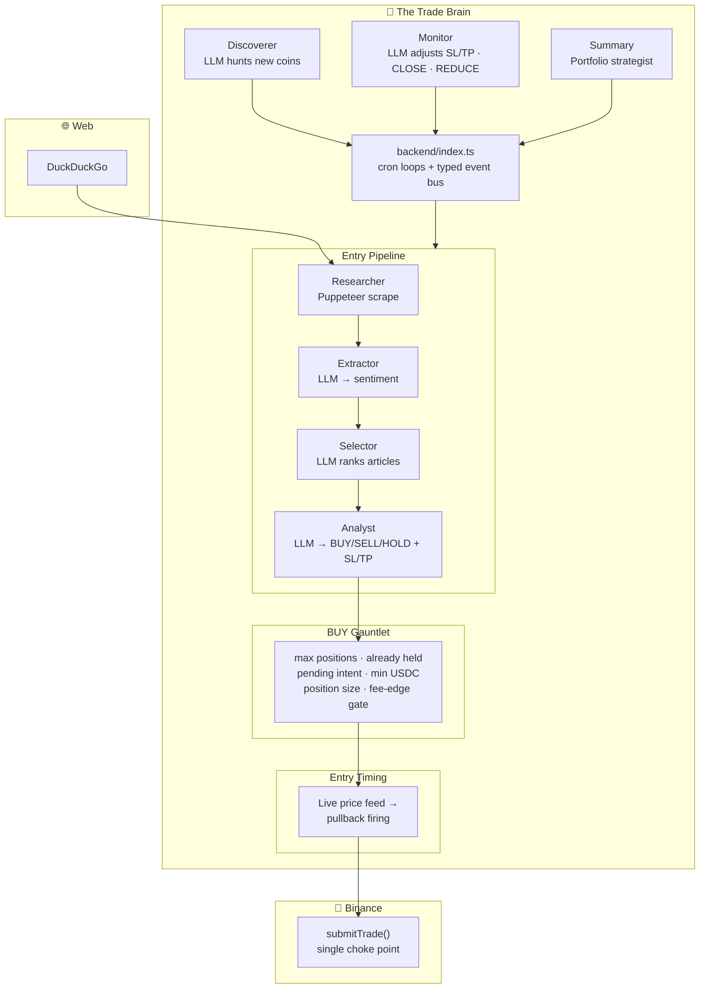

<div align="center">

# cryptoBot

### An autonomous, LLM-driven crypto trading system

<br>

[](https://www.typescriptlang.org/)
[](https://nodejs.org/)
[](https://react.dev/)
[](https://vitejs.dev/)
[](https://tailwindcss.com/)
[](https://www.mongodb.com/)
[](https://www.docker.com/)
[](https://expressjs.com/)
[](https://github.com/ccxt/ccxt)
[](https://pptr.dev/)

<br>

**Local LLMs (Ollama / llama.cpp)** · **Binance via ccxt** · **Puppeteer web research** · **Telegram approvals**

</div>

---

> **⚠️ WARNING:** This software places **real orders with real money on Binance**. There is no paper/stub mode — live API keys are required. Crypto trading carries substantial risk of loss. Start tiny, keep human approval (`--approval`) on until you trust its behavior. **Nothing here is financial advice.**

---

## What it does

cryptoBot is not a single strategy — it's a **team of specialized AI engines**, each running on its own schedule, cooperating through a typed event bus. They search the web for news, compress it into structured sentiment, debate BUY/SELL/HOLD, time the entry on a live price feed, then babysit every open position until it closes.



---

## The engines

Each engine is an independent cron loop. They never trade directly — they **emit events** that orchestrator handles, with `submitTrade()` as the single choke point for every exchange order.

| Engine | Schedule | Role |
|---|---|---|
| **Pipeline** 🔬 | `pipeline_cron` | Full entry pipeline: Researcher → Extractor → Selection → Analyst → BUY gauntlet → entry timing |
| **Discoverer** 🛰️ | `discover_cron` | LLM-scored hunt for new candidate coins; approved picks feed the watchlist |
| **Monitor** 👁️ | `monitor_cron` | Manages open positions — proposes SL/TP adjustments, CLOSE, or REDUCE |
| **Summary** 📊 | `summary_cron` | Read-only portfolio strategist; narrative briefings with market context |
| **Position check** 🔁 | Every 30s | Reconciles open positions against live prices and exchange OCO fills |
| **Agent** 💬 | On demand | Conversational tool-calling assistant (safe read-only + watchlist actions) |

### Smart entry timing

When `entry_timing_enabled`, a BUY signal isn't filled at the cron tick. It's registered as an **intent** that watches the live price feed and fires only on a pullback — or cancels by invalidate-drop, chase-cap, or TTL. The entry band anchors to the live price at registration (the analyzed price is minutes-stale after the slow LLM pipeline). Position sizing and the fee-edge gate stay on the decision-time price.

### The BUY gauntlet

Before any BUY becomes real it must clear: **max positions** · **not already held** · **no pending intent** · **min USDC** · **position size** · and the **fee-edge gate** (`hasSufficientEdge` — expected move must beat round-trip fees).

---

## LLM integration

Every LLM call goes through `core/llm.ts` against **local OpenAI-compatible endpoints** (Ollama / llama.cpp) via the OpenAI SDK.

- **Shared endpoint catalog** — define named `{ baseURL, model, maxTokens, parallel }` endpoints in Settings → LLM Models; each module selects one by id
- **Per-module fallback** — if a primary endpoint throws, the same prompt retries once against a configured fallback. Each attempt is logged as its own `llm_calls` row
- **Per-key concurrency gates** — each base URL capped at one in-flight call by default; different URLs run in parallel. Endpoints flagged `parallel` lift the cap with optional `maxParallel` limits
- **Full observability** — every call recorded; live calls stream to the frontend's LLM activity view

---

## Architecture

A monorepo of two independent Node packages that talk over **HTTP + WebSocket** (`ws://localhost:3000/ws`) — no shared package.

```
cryptoBot/
├── backend/          Node.js + TypeScript (ESM) — the long-running trade brain
│   └── src/
│       ├── index.ts        ⭐ orchestrator: cron loops + event bus + submitTrade()
│       ├── core/           typed event bus · LLM client · logger · errors
│       ├── pipeline/       entry decision pipeline (research → extract → analyze → buy)
│       ├── discoverer/     LLM-driven new coin discovery
│       ├── monitor/        open position management
│       ├── summary/        portfolio strategist / briefings
│       ├── entry/          deferred entry timing engine (pullback firing)
│       ├── entryPlanner/   per-coin entry band planning via LLM
│       ├── agent/          tool-calling conversational assistant
│       ├── execution/      submitTrade() · exits · adjustments · approvals
│       ├── portfolio/      sizing · ATR SL/TP · OCO · fee-aware PnL · fee-edge gate
│       ├── market/         live price cache (WebSocket) + OHLCV / indicators
│       ├── trader/         ccxt Binance wrapper
│       ├── scraper/        Puppeteer-extra stealth browser + DuckDuckGo search
│       ├── telegram/       Telegraf approval bot + notifier
│       ├── api/            Express routes + WebSocket broadcast
│       ├── db/             MongoDB repositories · indexes · transactions · counters · settings cache
│       ├── config/         env config · LLM endpoint resolution
│       └── types.ts        shared TypeScript types
└── frontend/         React + Vite + Tailwind — single-page app (no router)
    └── src/pages/    Dashboard · Agent · Portfolio · Trade · Monitor · EntryDesk
                      Discover · Charts · LLM / Stats / Debug · Cache · TradingState
                      Settings · Logs · Summary · AgentMonitor · ControlRoom · Host
```

### Key conventions

- Each module's public API is its `index.ts` — never import internal files
- Cross-module side effects go through the typed event bus (`core/events.ts`)
- Structured logging only: `logger.info('msg', { data })`
- Shared types in `backend/src/types.ts`

### Database

**MongoDB 7** (single-node replica set `rs0`, required for transactions). One database (`cryptobot`), one collection per entity. Access through typed `Repository` instances in `db/repositories.ts` — never the driver directly. Schema managed via code (indexes in `db/indexes.ts`). Migrated from legacy SQLite (`data/*.db`).

---

## Quick start

### Prerequisites

- **Node.js 22+** (or Docker)
- **Binance** account with API key + secret
- **Local OpenAI-compatible LLM** — [Ollama](https://ollama.com/) or llama.cpp
- *(optional)* Telegram bot for trade approvals

### 1. Configure

```bash
cp .env.example .env
```

```ini
# Required
BINANCE_API_KEY=your_key
BINANCE_SECRET=your_secret
LLAMA_BASE_URL=http://host.docker.internal:11434/v1   # or http://localhost:11434/v1 bare-metal
LLAMA_MODEL=llama3

# Optional
TELEGRAM_BOT_TOKEN=
TELEGRAM_CHAT_ID=
PORT=3000
```

Per-module LLM overrides (`EXTRACTOR_*`, `ANALYST_*`, etc.) all fall back to `LLAMA_*` — set them only for different models per engine. Most LLM config can also be changed live from **Settings → LLM Models**.

### 2a. Docker (recommended)

```bash
docker-compose up
```

Backend on **:3000**, frontend on **:5173**, MongoDB on **:27017**, `data/` bind-mounted.

### 2b. Bare-metal

```bash
# Terminal 1 — Backend
cd backend && npm install && npm run dev       # tsx watch, hot-reload :3000

# Terminal 2 — Frontend
cd frontend && npm install && npm run dev      # Vite dev server :5173
```

Open **http://localhost:5173**

> 🔐 **Start safe:** launch with `--approval` (or set `approval_required` in settings) to require human approval for every trade signal.

---

## Commands

| | Backend (`backend/`) | Frontend (`frontend/`) |
|---|---|---|
| **dev** | `npm run dev` — hot-reload :3000 | `npm run dev` — Vite :5173 |
| **start** | `npm start` | `npm run preview` |
| **build** | `npm run build` | `npm run build` |
| **check** | `npm run lint` — type-check (only automated gate) | — |

There is **no unit-test runner** — `npm run lint` (TypeScript type-check) is the gate. Verify behavior by running the app.

### Ops toolkit (`tools/`)

```bash
node tools/db.mjs  collections                 # inspect MongoDB
node tools/db.mjs  trades 10
node tools/db.mjs  positions

node tools/app.mjs status                      # start / stop / logs / lint
node tools/app.mjs logs backend 200
node tools/app.mjs restart backend
```

See [AGENTS.md](./AGENTS.md) and [tools/README.md](./tools/README.md) for full usage.

---

## One-click updates

**Settings → System → Update app** pulls the latest `main` and rebuilds + restarts the whole stack from the dashboard — no SSH needed. A host-side **systemd watcher** handles the update (survives `docker compose down`). The page shows an "Updating…" overlay and reloads once the new build is online.

```bash
sudo tools/updater/install-updater.sh
```

See [tools/updater/README.md](./tools/updater/README.md) for details.

---

## Dashboard

A single-page React app (no router — pages switch via `useState`) with **4 themes** and live data over WebSocket:

**Dashboard** · **Agent** (chat with assistant) · **Portfolio** · **Trade** · **Monitor** · **EntryDesk** (pending intents) · **Discover** · **Charts** (recharts candles) · **LLM / LLMStats / LLMDebug** · **CacheView** · **TradingState** · **Settings** · **Logs** · **Summary** · **AgentMonitor** · **ControlRoom** · **Host**

Saving settings reschedules affected cron loops **live** — no restart needed.

---

## Further reading

- **[CLAUDE.md](./CLAUDE.md)** — deep architecture & code conventions
- **[AGENTS.md](./AGENTS.md)** — running & inspecting the app safely

---

<div align="center">

**Built with TypeScript, local LLMs, and a healthy respect for risk.**

⭐ *Trade responsibly.*

</div>
